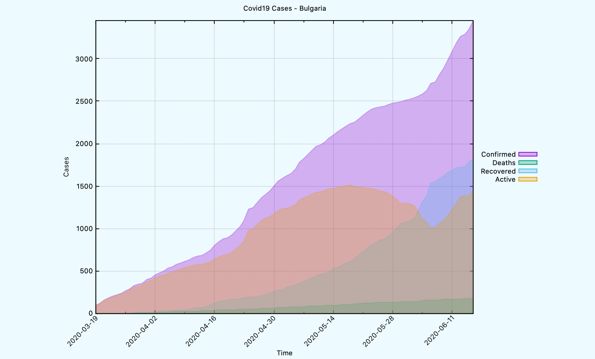
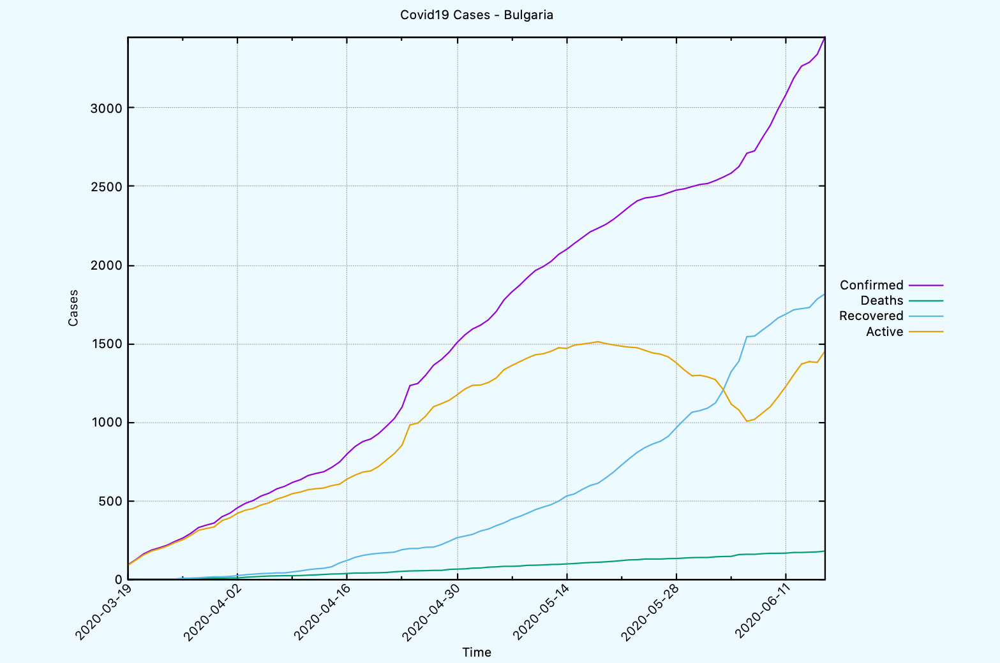
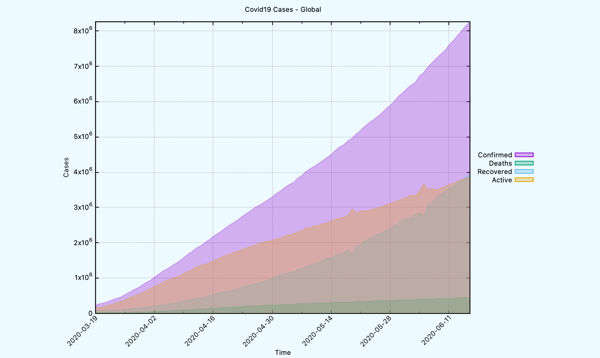
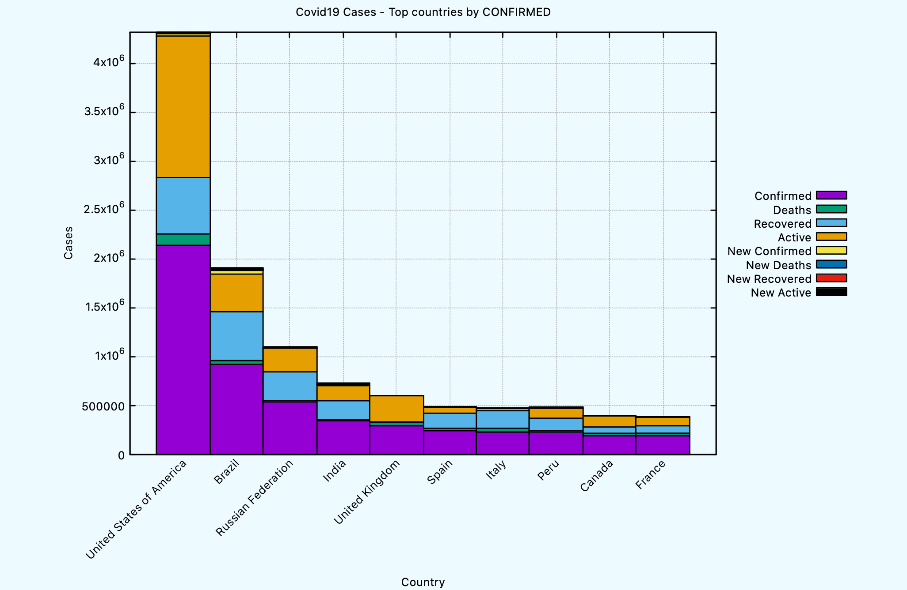

# Explore COVID-19 data in Common Lisp

The `cl-covid19` system provides APIs for exploring and reviewing
[COVID-19](https://en.wikipedia.org/wiki/Coronavirus_disease_2019)
data in Common Lisp.

The system fetches time-series data from the [COVID-19
API](https://covid19api.com), and persists it locally in a
[SQLite](https://www.sqlite.org) database, so it can be reviewed
offline.



## Requirements

* [Quicklisp](https://www.quicklisp.org/beta/)
* [SQLite3](https://sqlite.org) dev libraries
* [gnuplot](http://gnuplot.sourceforge.net) for plotting graphs
- [cl-migratum](https://github.com/dnaeon/cl-migratum) for database migrations

## Installation

Clone the `cl-covid19` repo in your [Quicklisp
local-projects](https://www.quicklisp.org/beta/faq.html) directory.

``` shell
git clone https://github.com/dnaeon/cl-covid19.git
```

Load the system.

``` common-lisp
CL-USER> (ql:quickload :cl-covid19)
```

## Usage

The following section provides examples to get you started.

### Create Database

First, we need to create a connection to the SQLite database.

``` common-lisp
CL-USER> (defparameter *db-conn*
           (covid19:make-db-conn "covid19.db"))
*DB-CONN*
```

Next, we need to apply the database migrations, so that the database
schema is properly created. Database schema migrations are handled by
[cl-migratum](https://github.com/dnaeon/cl-migratum) system.

``` common-lisp
CL-USER> (covid19:migrate-db *db-conn*)
```

You should see similar output when applying the database migrations.
``` common-lisp
 <INFO> [16:01:37] cl-migratum.core core.lisp (apply-pending) -
  Found 3 pending migration(s) to be applied
 <INFO> [16:01:37] cl-migratum.core core.lisp (apply-and-register) -
  Applying migration 20200608135822 - create_countries_table
 <INFO> [16:01:37] cl-migratum.core core.lisp (apply-and-register) -
  Applying migration 20200611230626 - add_time_series_table
 <INFO> [16:01:37] cl-migratum.core core.lisp (apply-and-register) -
  Applying migration 20200611234716 - add_time_series_views
```

The local SQLite database provides the following tables and views.

| Name                             | Description                                        |
|----------------------------------|----------------------------------------------------|
| `migration`                      | Contains the applied database migrations           |
| `country`                        | Contains the countries fetched from the remote API |
| `time_series`                    | Time series for each country and location          |
| `time_series_global`             | Aggregated global time series                      |
| `time_series_per_country`        | Time series data per country                       |
| `time_series_per_country_latest` | Latest time series data per country                |

### Create API Client

In order to fetch data from the COVID-19 API, we need to create an
API client.

``` common-lisp
CL-USER> (defparameter *api-client*
           (covid19:make-api-client))
*API-CLIENT*
```

### Updating local database with latest time series data

Using the API client we've created in the previous step we can now
fetch the latest time-series data and persist them locally in our
database. In order to do that simply call the
`COVID19:UPDATE-ALL-DATA` function.

``` common-lisp
CL-USER> (covid19:update-all-data *api-client* *db-conn*)
T
```

You should probably do that once in a day, since time-series data
usually gets updated on daily basis.

### Fetching data from the database

The following examples show how to fetch various data from the
database.

By default each fetch function will return up to
`COVID19:*DEFAULT-RESULT-LIMIT*` number of items. You can either use
the `:limit` keyword parameter of the fetch function you use, or
rebind the above parameter to a value you want.

Here's how to fetch ten countries using the `COVID19:FETCH-COUNTRIES`
function. You can control the number of results to fetch by using the
`:limit` keyword parameter.

``` common-lisp
CL-USER> (covid19:fetch-countries *db-conn* :limit 10)
((:|id| 1 :|iso_code| "JE" :|name| "Jersey" :|slug| "jersey")
 (:|id| 2 :|iso_code| "MM" :|name| "Myanmar" :|slug| "myanmar")
 (:|id| 3 :|iso_code| "NA" :|name| "Namibia" :|slug| "namibia")
 (:|id| 4 :|iso_code| "SO" :|name| "Somalia" :|slug| "somalia")
 (:|id| 5 :|iso_code| "AU" :|name| "Australia" :|slug| "australia")
 (:|id| 6 :|iso_code| "GD" :|name| "Grenada" :|slug| "grenada")
 (:|id| 7 :|iso_code| "JP" :|name| "Japan" :|slug| "japan")
 (:|id| 8 :|iso_code| "QA" :|name| "Qatar" :|slug| "qatar")
 (:|id| 9 :|iso_code| "UM" :|name| "US Minor Outlying Islands" :|slug|
  "us-minor-outlying-islands")
 (:|id| 10 :|iso_code| "AG" :|name| "Antigua and Barbuda" :|slug|
  "antigua-and-barbuda"))
```

You can also use the `COVID19:DISPLAY-TABLE` function to display a
table of the fetched results from your REPL.

``` common-lisp
CL-USER> (covid19:display-table
          (covid19:fetch-countries *db-conn* :limit 10))
+----+----------+---------------------------+---------------------------+
| id | iso_code | name                      | slug                      |
+----+----------+---------------------------+---------------------------+
|  1 | JE       | Jersey                    | jersey                    |
|  2 | MM       | Myanmar                   | myanmar                   |
|  3 | NA       | Namibia                   | namibia                   |
|  4 | SO       | Somalia                   | somalia                   |
|  5 | AU       | Australia                 | australia                 |
|  6 | GD       | Grenada                   | grenada                   |
|  7 | JP       | Japan                     | japan                     |
|  8 | QA       | Qatar                     | qatar                     |
|  9 | UM       | US Minor Outlying Islands | us-minor-outlying-islands |
| 10 | AG       | Antigua and Barbuda       | antigua-and-barbuda       |
+----+----------+---------------------------+---------------------------+
NIL
```

In order to get a specific country by either name or ISO code you can use the
`COVID19:FETCH-COUNTRY` function, e.g.

``` common-lisp
CL-USER> (covid19:fetch-country *db-conn* "BG")
((:|id| 44 :|iso_code| "BG" :|name| "Bulgaria" :|slug| "bulgaria"))
```

Time series data can be fetched using the `COVID19:FETCH-TIME-SERIES`
function. The results will contain historical records for each
country, ordered by timestamp in descending order.

``` common-lisp
CL-USER> (covid19:display-table
          (covid19:fetch-time-series *db-conn* :limit 10))
+----------------------+-----------+--------+-----------+--------+---------------+------------+---------------+------------+------------+---------------------+---------------------+------------------+
| timestamp            | confirmed | deaths | recovered | active | new_confirmed | new_deaths | new_recovered | new_active | country_id | country_name        | country_slug        | country_iso_code |
+----------------------+-----------+--------+-----------+--------+---------------+------------+---------------+------------+------------+---------------------+---------------------+------------------+
| 2020-06-16T00:00:00Z |       262 |      6 |       179 |     77 |             0 |          0 |             4 |         -4 |          2 | Myanmar             | myanmar             | MM               |
| 2020-06-16T00:00:00Z |        34 |      0 |        18 |     16 |             2 |          0 |             1 |          1 |          3 | Namibia             | namibia             | NA               |
| 2020-06-16T00:00:00Z |      2658 |     88 |       649 |   1921 |            16 |          0 |            27 |        -11 |          4 | Somalia             | somalia             | SO               |
| 2020-06-16T00:00:00Z |      7370 |    102 |      6861 |    407 |            23 |          0 |             5 |         18 |          5 | Australia           | australia           | AU               |
| 2020-06-16T00:00:00Z |        23 |      0 |        22 |      1 |             0 |          0 |             0 |          0 |          6 | Grenada             | grenada             | GD               |
| 2020-06-16T00:00:00Z |     17484 |    934 |     15652 |    898 |            45 |          5 |            85 |        -45 |          7 | Japan               | japan               | JP               |
| 2020-06-16T00:00:00Z |     82077 |     80 |     60461 |  21536 |          1201 |          4 |          1780 |       -583 |          8 | Qatar               | qatar               | QA               |
| 2020-06-16T00:00:00Z |        26 |      3 |        22 |      1 |             0 |          0 |             2 |         -2 |         10 | Antigua and Barbuda | antigua-and-barbuda | AG               |
| 2020-06-16T00:00:00Z |       532 |      9 |       236 |    287 |            49 |          0 |             4 |         45 |         11 | Benin               | benin               | BJ               |
| 2020-06-16T00:00:00Z |      8931 |    212 |      7937 |    782 |            46 |          0 |           109 |        -63 |         12 | Morocco             | morocco             | MA               |
+----------------------+-----------+--------+-----------+--------+---------------+------------+---------------+------------+------------+---------------------+---------------------+------------------+
NIL
```

If you want to get the time-series data for a given country you can
use `COVID19:FETCH-TIME-SERIES-FOR-COUNTRY`. The following command will
return the data for the past 10 days.

``` common-lisp
CL-USER> (covid19:display-table
          (covid19:fetch-time-series-for-country *db-conn* "Bulgaria" :limit 10))
+----------------------+-----------+--------+-----------+--------+---------------+------------+---------------+------------+------------+--------------+--------------+------------------+
| timestamp            | confirmed | deaths | recovered | active | new_confirmed | new_deaths | new_recovered | new_active | country_id | country_name | country_slug | country_iso_code |
+----------------------+-----------+--------+-----------+--------+---------------+------------+---------------+------------+------------+--------------+--------------+------------------+
| 2020-06-16T00:00:00Z |      3453 |    181 |      1817 |   1455 |           112 |          5 |            33 |         74 |         44 | Bulgaria     | bulgaria     | BG               |
| 2020-06-15T00:00:00Z |      3341 |    176 |      1784 |   1381 |            51 |          2 |            54 |         -5 |         44 | Bulgaria     | bulgaria     | BG               |
| 2020-06-14T00:00:00Z |      3290 |    174 |      1730 |   1386 |            24 |          2 |             7 |         15 |         44 | Bulgaria     | bulgaria     | BG               |
| 2020-06-13T00:00:00Z |      3266 |    172 |      1723 |   1371 |            75 |          0 |             7 |         68 |         44 | Bulgaria     | bulgaria     | BG               |
| 2020-06-12T00:00:00Z |      3191 |    172 |      1716 |   1303 |           105 |          4 |            28 |         73 |         44 | Bulgaria     | bulgaria     | BG               |
| 2020-06-11T00:00:00Z |      3086 |    168 |      1688 |   1230 |            93 |          1 |            24 |         68 |         44 | Bulgaria     | bulgaria     | BG               |
| 2020-06-10T00:00:00Z |      2993 |    167 |      1664 |   1162 |           104 |          0 |            41 |         63 |         44 | Bulgaria     | bulgaria     | BG               |
| 2020-06-09T00:00:00Z |      2889 |    167 |      1623 |   1099 |            79 |          3 |            36 |         40 |         44 | Bulgaria     | bulgaria     | BG               |
| 2020-06-08T00:00:00Z |      2810 |    164 |      1587 |   1059 |            83 |          4 |            39 |         40 |         44 | Bulgaria     | bulgaria     | BG               |
| 2020-06-07T00:00:00Z |      2727 |    160 |      1548 |   1019 |            16 |          0 |             3 |         13 |         44 | Bulgaria     | bulgaria     | BG               |
+----------------------+-----------+--------+-----------+--------+---------------+------------+---------------+------------+------------+--------------+--------------+------------------+
NIL
```

Latest (most recent) time-series data per country can be fetched using
the `COVID19:FETCH-TIME-SERIES-LATEST` function, e.g.

``` common-lisp
CL-USER> (covid19:display-table
          (covid19:fetch-time-series-latest *db-conn* :limit 5))
+----------------------+-----------+--------+-----------+--------+---------------+------------+---------------+------------+------------+--------------+--------------+------------------+
| timestamp            | confirmed | deaths | recovered | active | new_confirmed | new_deaths | new_recovered | new_active | country_id | country_name | country_slug | country_iso_code |
+----------------------+-----------+--------+-----------+--------+---------------+------------+---------------+------------+------------+--------------+--------------+------------------+
| 2020-06-16T00:00:00Z |       262 |      6 |       179 |     77 |             0 |          0 |             4 |         -4 |          2 | Myanmar      | myanmar      | MM               |
| 2020-06-16T00:00:00Z |        34 |      0 |        18 |     16 |             2 |          0 |             1 |          1 |          3 | Namibia      | namibia      | NA               |
| 2020-06-16T00:00:00Z |      2658 |     88 |       649 |   1921 |            16 |          0 |            27 |        -11 |          4 | Somalia      | somalia      | SO               |
| 2020-06-16T00:00:00Z |      7370 |    102 |      6861 |    407 |            23 |          0 |             5 |         18 |          5 | Australia    | australia    | AU               |
| 2020-06-16T00:00:00Z |        23 |      0 |        22 |      1 |             0 |          0 |             0 |          0 |          6 | Grenada      | grenada      | GD               |
+----------------------+-----------+--------+-----------+--------+---------------+------------+---------------+------------+------------+--------------+--------------+------------------+
NIL
```

In order to fetch the top countries by given column you can use the
`COVID19:FETCH-TOP-COUNTRIES-BY` function. The following example will
display the top 5 countries by `confirmed` cases.

``` common-lisp
CL-USER> (mapcar (lambda (item)
                   (getf item :|country_name|))
                 (covid19:fetch-top-countries-by *db-conn* :column :confirmed :limit 5))
("United States of America" "Brazil" "Russian Federation" "India"
 "United Kingdom")
```

The `COVID19:FETCH-TIME-SERIES-GLOBAL` function returns the aggregated
time series on a global scale. The following example will display the
stats for the past 10 days.

``` common-lisp
CL-USER> (covid19:display-table
          (covid19:fetch-time-series-global *db-conn* :limit 10))
+----------------------+-----------+--------+-----------+---------+---------------+---------------+------------+------------+
| timestamp            | confirmed | deaths | recovered | active  | new_confirmed | new_recovered | new_deaths | new_active |
+----------------------+-----------+--------+-----------+---------+---------------+---------------+------------+------------+
| 2020-06-16T00:00:00Z |   8274306 | 451939 |   3954518 | 3867849 |        139803 |         97831 |       6829 |      35143 |
| 2020-06-15T00:00:00Z |   8134503 | 445110 |   3856687 | 3832706 |        133896 |         87626 |       3843 |      42427 |
| 2020-06-14T00:00:00Z |   8000607 | 441267 |   3769061 | 3790279 |        134333 |         71408 |       3365 |      59560 |
| 2020-06-13T00:00:00Z |   7866274 | 437902 |   3697653 | 3730719 |        134598 |         85027 |       4400 |      45171 |
| 2020-06-12T00:00:00Z |   7731676 | 433502 |   3612626 | 3685548 |        118757 |         72581 |       3990 |      42186 |
| 2020-06-11T00:00:00Z |   7612919 | 429512 |   3540045 | 3643362 |        154681 |         85889 |       5290 |      63502 |
| 2020-06-10T00:00:00Z |   7458238 | 424222 |   3454156 | 3579860 |        118483 |         79139 |       4833 |      34511 |
| 2020-06-09T00:00:00Z |   7339755 | 419389 |   3375017 | 3545349 |        124338 |         82260 |       4974 |      37104 |
| 2020-06-08T00:00:00Z |   7215417 | 414415 |   3292757 | 3508245 |        109895 |        152488 |       3825 |     -46418 |
| 2020-06-07T00:00:00Z |   7105522 | 410590 |   3140269 | 3554663 |        118555 |         55087 |       3039 |      60429 |
+----------------------+-----------+--------+-----------+---------+---------------+---------------+------------+------------+
NIL
```

### Executing database queries

If you need to execute a custom query or statement against the
database you can use the `COVID19:DB-EXECUTE` function.

The following example will fetch a country by given ISO code,
using a parameterized query.

``` common-lisp
CL-USER> (covid19:db-execute *db-conn* "SELECT * FROM country WHERE iso_code = ?" "BG")
((:|id| 44 :|iso_code| "BG" :|name| "Bulgaria" :|slug| "bulgaria"))
```

You can pass the result of `COVID19:DB-EXECUTE` to `COVID19:DISPLAY-TABLE` to
display the results in a nice table format.

### Exporting data to CSV

If you need to export the data in CSV format you can do that by using
the `COVID19:WRITE-CSV` function. This example will export all
time series data for a given country.

``` common-lisp
CL-USER> (with-open-file (out "/tmp/covid19-bg.csv" :direction :output)
           (covid19:write-csv (covid19:fetch-time-series-for-country *db-conn* "BG") :stream out))
```

### Plotting graphs

The following examples assume that you have
[gnuplot](http://gnuplot.sourceforge.net) installed already.

In order to plot a graph using the time series data for a given
country you can use the `COVID19:PLOT-TIME-SERIES-FOR-COUNTRY`
function. The `:limit` keyword parameter controls how many rows of
data will be fetched from the database.

This example shows how to plot the data for past 90 days for a given
country.

``` common-lisp
CL-USER> (covid19:plot-time-series-for-country *db-conn*
                                               "Bulgaria"
                                               :limit 90)
NIL
```

This is how the plot looks like at the time of writing this document.


If you want to use lines, instead of filled curves, which is what
above plot generated you can specify an alternative template to be
used when plotting the graph, e.g.

``` common-lisp
CL-USER> (covid19:plot-time-series-for-country *db-conn*
                                               "Bulgaria"
                                               :limit 90
                                               :template covid19:*gnuplot-time-series-with-lines-template*)
NIL
```

The generated graph looks like this.



Another plot function that can be used is `COVID19:PLOT-TIME-SERIES-GLOBAL`.

``` common-lisp
CL-USER> (covid19:plot-time-series-global *db-conn* :limit 90)
NIL
```

The generated graph on a global scale looks like this.



The `COVID19:PLOT-TOP-COUNTRIES-BY` function can be used to plot countries
by sorting them first on a given column. Here's an example to plot a histogram
per each country based on the latest data from the `confirmed` column.

``` common-lisp
CL-USER> (covid19:plot-top-countries-by *db-conn* :column :confirmed :limit 10)
NIL
```

An example generated graph looks like this.



Another set of useful templates which show the new cases per country
or on global scale are
`COVID19:*GNUPLOT-TIME-SERIES-WITH-FILLED-CURVES-NEW-CASES*` and
`COVID19:*GNUPLOT-TIME-SERIES-WITH-LINES-NEW-CASES*`.

You could also render any of the existing `gnuplot(1)` templates
defined in the `COVID19.GNUPLOT-TEMPLATE` package and customize them
further, if needed.

In order to do that you need to pass at least two arguments to the
template while rendering it - one for the title of the graph, and
another one which points to the path containing data points.

The following example shows how to export the data points for a given country to a
file, and then renders a template using that file.

``` common-lisp
CL-USER> (let ((csv-file #P"/tmp/covid19-bg.csv")
               (data-points (covid19:fetch-time-series-for-country *db-conn* "Bulgaria" :limit 90)))
           (with-open-file (out csv-file :direction :output)
             (covid19:write-csv data-points :stream out))
           (covid19:render-gnuplot-template covid19:*gnuplot-time-series-with-filled-curves-template*
                                            :title "Bulgaria"
                                            :datafile (namestring csv-file)))
"#
# gnuplot(1) template for plotting time series with filledcurves
#

set title 'Covid19 Cases - Bulgaria'
set grid
set xdata time
set timefmt '%Y-%m-%dT%H:%M:%S+00:00Z'
set format x '%Y-%m-%d'
set xtics rotate by 45 right
set xlabel 'Time'
set ylabel 'Cases'
set key outside right center
set datafile separator ','
set autoscale fix
set style fill transparent solid 0.3
plot '/tmp/covid19-bg.csv' using 1:2:(0) title 'Confirmed' with filledcurves, \\
     '' using 1:3:(0) title 'Deaths' with filledcurves, \\
     '' using 1:4:(0) title 'Recovered' with filledcurves, \\
     '' using 1:5:(0) title 'Active' with filledcurves
"
```

### Debug logging

The `cl-covid19` system uses `log4cl` for logging purposes.

If you need to adjust the logging level (e.g. set it to `debug` level), simply
evaluate the following expression.

``` common-lisp
CL-USER> (log:config :debug)
```

## API Client Usage

This section provides some examples on how to use the API client for
interfacing with the [COVID-19 API](https://covid19api.com).

The `COVID19.API` package exports functionality for creating an API
client and fetching data from the remote API endpoint, most of these
symbols are re-exported by the `COVID19` package.

First, create an API client.

``` common-lisp
CL-USER> (defparameter *api-client*
           (covid19:make-api-client))
*API-CLIENT*
```

If you experience timeout issues, you can also change the timeout
settings of the HTTP client, e.g.

``` common-lisp
(setf dexador:*default-connect-timeout* 300)
(setf dexador:*default-read-timeout* 300)
```

You can get the list of countries by using the `COVID19:GET-COUNTRIES-DATA` function, e.g.

``` common-lisp
CL-USER> (covid19.api:get-countries-data *api-client*)
```

A summarized statistics for COVID-19 can be retrieved by using the `COVID19:GET-SUMMARY-DATA`
function, e.g.

``` common-lisp
CL-USER> (covid19.api:get-summary-data *api-client*)
```

The COVID-19 API provides an endpoint for exporting all data as a ZIP
archive.  You can get a ZIP archive of all time series data by using
the `COVID19:GET-TIME-SERIES-ARCHIVE` function, e.g.

``` common-lisp
CL-USER> (covid19:get-time-series-archive *api-client* #P"/tmp/all-data.zip")
```

You can also display the list of available API endpoints by using the
`COVID19:DISPLAY-API-ROUTES` function, e.g.

``` common-lisp
CL-USER> (covid19:display-api-routes *api-client*)
```

An example output looks like this.

``` text
.-------------------------------------------------------------------------------------------------------------------------------------------------------------------------.
|                                                                           API Routes @ v0.0.8                                                                           |
+--------------------------------------------------+----------------------------------------------------------------------------------------------------------------------+
| PATH                                             | NAME                                                                                                                 |
+--------------------------------------------------+----------------------------------------------------------------------------------------------------------------------+
| /webhook                                         | Add a webhook to be notified when new data becomes available                                                         |
| /summary                                         | Summary of new and total cases per country                                                                           |
| /live/country/:country/status/:status            | Get a time series Of Cases Per Country Per Province By Case Type                                                     |
| /live/country/:country/status/:status/date/:date | Get a Time Series Of Cases Per Country Per Province By Case Type After A Date                                        |
| /live/country/:country                           | Get Live List Of Cases Per Country Per Province By Case Type                                                         |
| /export                                          | Get All Data as a zip file                                                                                           |
| /total/country/:country                          | Get List Of Cases Per Country By Case Type                                                                           |
| /total/country/:country/status/:status           | Get List Of Cases Per Country By Case Type                                                                           |
| /country/:country/status/:status                 | Get List Of Cases Per Country Per Province By Case Type                                                              |
| /country/:country/status/:status/live            | Daily list of cases per Country per Province by Case Type, updated with latest live count                            |
| /total/dayone/country/:country/status/:status    | Get List Of Cases Per Country By Case Type From The First Recorded Case                                              |
| /dayone/country/:country/status/:status          | Get List Of Cases Per Country Per Province By Case Type From The First Recorded Case                                 |
| /dayone/country/:country/status/:status/live     | Get List Of Cases Per Country Per Province By Case Type From The First Recorded Case, updated with latest live count |
| /country/:country                                | Get List Of Cases Per Country Per Province By Case Type                                                              |
| /total/dayone/country/:country                   | Get List Of Cases Per Country By Case Type From The First Recorded Case                                              |
| /dayone/country/:country                         | Get List Of Cases Per Country Per Province By Case Type From The First Recorded Case                                 |
| /countries                                       | Get List Of Countries                                                                                                |
| /all                                             | Get All Data                                                                                                         |
+--------------------------------------------------+----------------------------------------------------------------------------------------------------------------------+
```

## Various ~/.sqliterc config settings

When using the command-line interface of SQLite, you might find these
config settings useful, which you can just drop in your `~/.sqliterc`
file.

``` text
.headers on
.mode column
.timer on
```

## Contributing

`cl-covid19` is hosted on
[Github](https://github.com/dnaeon/cl-covid19). Please contribute by
reporting issues, suggesting features or by sending patches using pull
requests.

## Authors

* [Marin Atanasov Nikolov](mailto:dnaeon@gmail.com)

## License

This project is Open Source and licensed under the [BSD
License](http://opensource.org/licenses/BSD-2-Clause).
